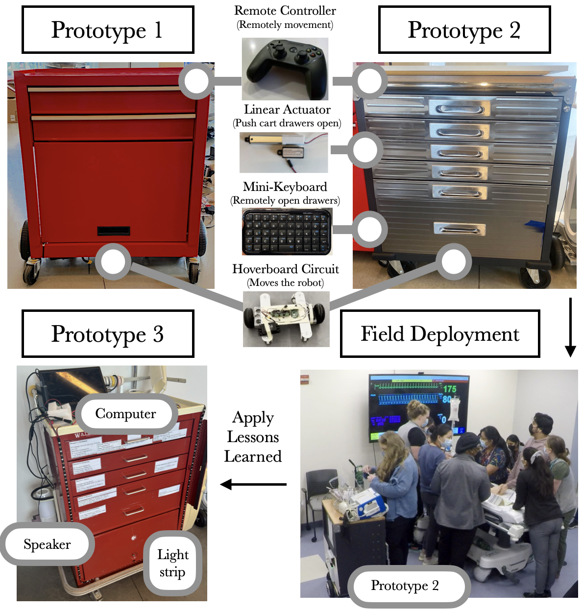
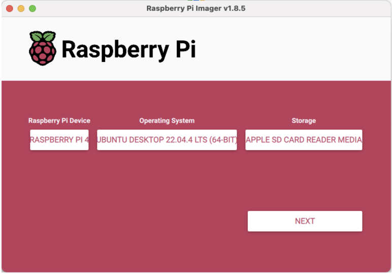
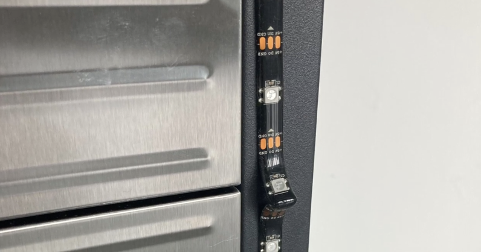
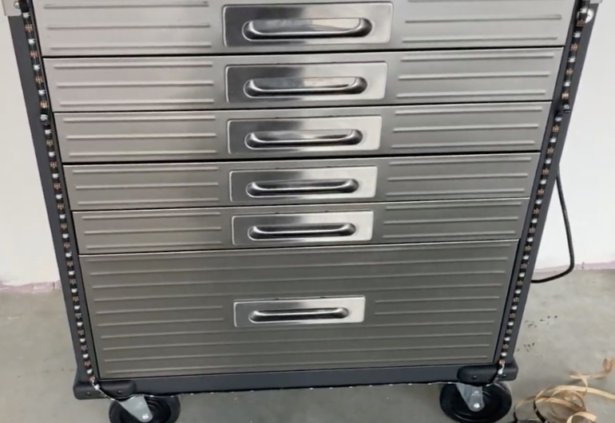
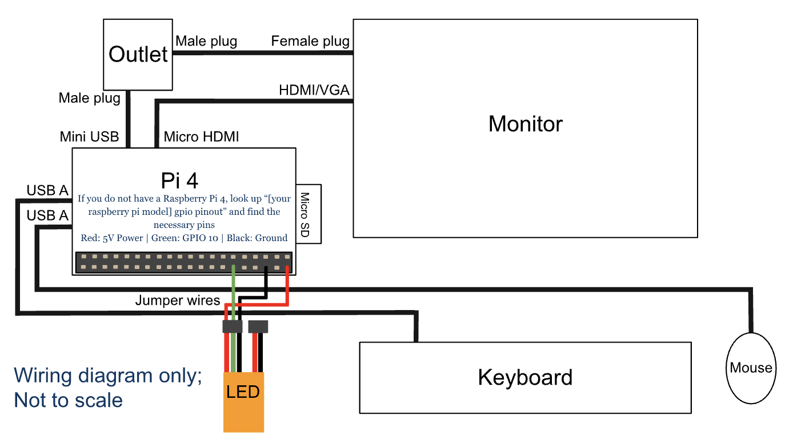
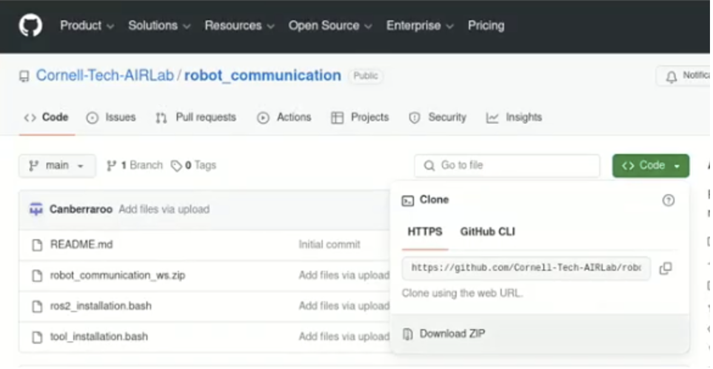
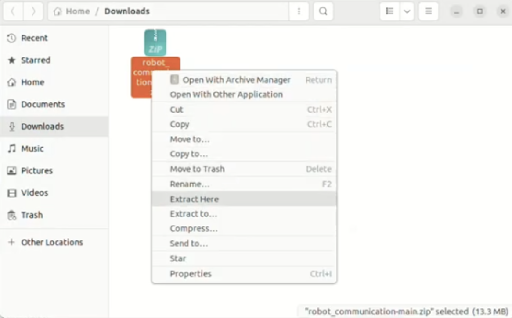
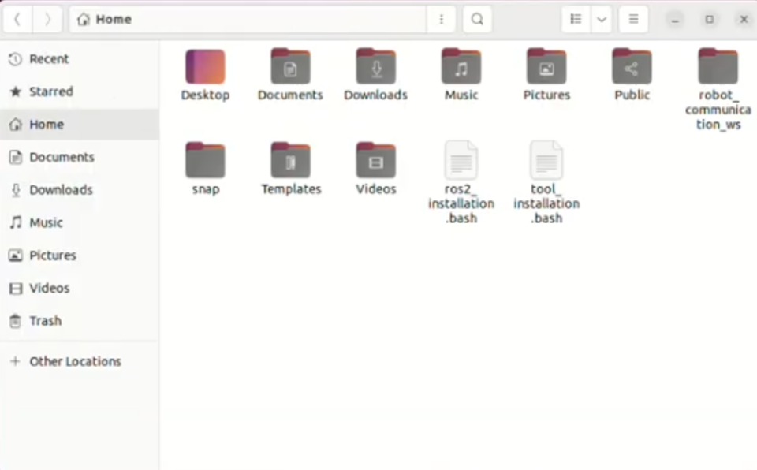
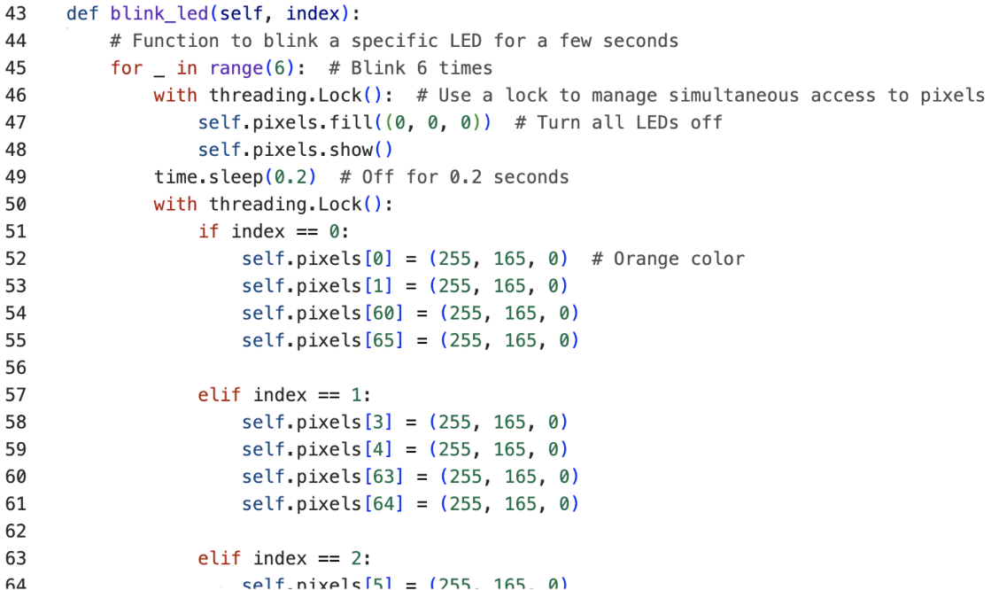
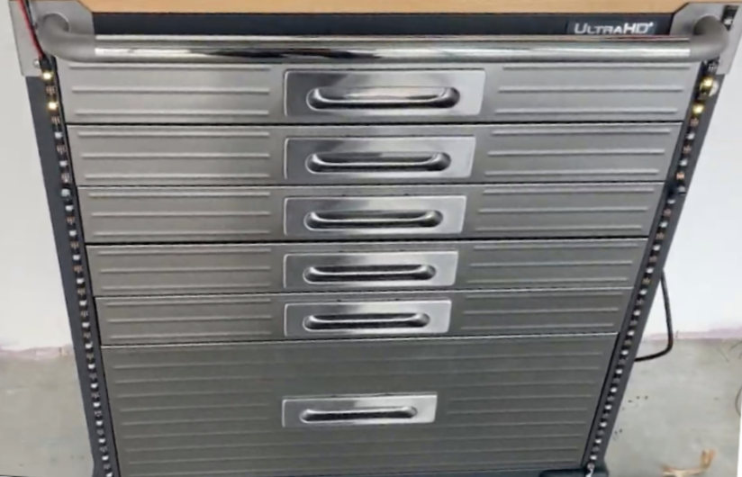

# CRASH-CART-ROBOT-TUTORIAL-HRI 🤖

Crash Cart Robot Tutorial 

<p align="center"> 
 
</p>

This tutorial provides step-by-step instructions to build a low-cost cart robot with multimodal feedback capabilities using speech, drawer lights, and alerts to indicate the location of relevant supplies and task reminders.

See the Tutorial on [YouTube](https://www.youtube.com/watch?v=EV-0HwNPJiY).

Taylor, A., Tanjim, T., Sack, M., Hirsch, M., Cheng, K., Ching, K., St. George, J., Roumen, T., Jung, M., Lee, H. (2025) “Rapidly Built Medical Crash Cart! Lessons Learned and Impacts on High-Stakes Team Collaboration in the Emergency Room.” In Proc. of the 20th Annual ACM/IEEE Conference on Human Robot Interaction (HRI).

Taylor, A., Tanjim, T, Cao, H., Lee, H. “Towards Collaborative Crash Cart Robots that Support Clinical Teamwork.” In Proc. of the 19th Annual ACM/IEEE Conference on Human-Robot Interaction (HRI). *2024 Best Paper Honorable Mention*

<p align="center"> 
 

<b>Figure 1:</b> We built a series of teleoperated medical crash cart robots. Prototype 1 delivers supplies using a hoverboard circuit. Prototype 2 also delivers supplies, recommends supplies using drawer opening capabilities, and was deployed at a medical training event which revealed insights which led to the design of Prototype 3 that communicates recommendations and reminders using drawer lights, speech, and alerts.

</p>

## System Requirements
- Ubuntu 22.04.4 LTS (64-BIT)
- Python Version???
- Robot Operating System 2 (Distribution ???)

Contents: 
- [Introduction](#introduction) 
- [Materials and Supplies](#materials_supplies) 
- [Medical Crash Cart Robot Tutorial Steps](#medical_crash_cart_robot_tutorial_steps) 

## Introduction

Designing robots to support high-stakes teamwork in emergency settings presents unique challenges, including seamless integration into fast-paced environments, facilitating effective communication among team members, and adapting to rapidly changing situations. While tele-operated robots have been successfully used in high-stakes domains such as firefighting and space exploration, autonomous robots that aid high-stakes teamwork remain underexplored. To address this gap, we conducted a rapid prototyping process to develop a series of seemingly autonomous robot designed to assist clinical teams in the Emergency Room. We transformed a standard crash cart—which stores medical equipment and emergency supplies into a medical robotic crash cart (MCCR). The MCCR was valuated through field deployments to assess its impact on team workload and usability, identified taxonomies of failure, and refined the MCCR in collaboration with healthcare professionals. Our work advances the understanding of robot design for high-stakes, time-sensitive settings, providing insights into useful MCCR capabilities and considerations for effective human-robot collaboration. By publicly disseminating our MCCR tutorial, we hope to encourage HRI researchers to explore the design of robots for high-stakes teamwork.

You can use this bibtex to cite this work ([Taylor et al.](https://www.angeliquemtaylor.com/), 2025): 

``` 
@article{taylor_2025, 
author = {Taylor, A., Tanjim, T., Sack, M., Hirsch, M., Cheng, K., Ching, K., St. George, J., Roumen, T., Jung, M., Lee, H.}, 
title = {Rapidly Built Medical Crash Cart! Lessons Learned and Impacts on High-Stakes Team Collaboration in the Emergency Room.}, 
journal = {In Proc. of the ACM/IEEE Conference on Human Robot Interaction (HRI).}, 
year = {2025}
}
```

## Materials and Supplies

The parts list includes required supplies, price, quantity, and a link to a recommended source. You likely already own most items. The total cost of the supplies is $417.

The battery pack is optional; two wall outlets serves as an alternative. A Linux laptop computer is required.


| Item                                     | Price         | Quantity      | URL           |
| ---------------------------------------- | ------------- | ------------- | ------------- |
| Raspberry Pi 4  (At least 4 GB)          | $55.00        | 1             | [Amazon](https://www.adafruit.com/product/4296)  |
| Individually addressable LED light strip | $17.99        | 1             | [Amazon](https://www.amazon.com/VISDOLL-Individually-Addressable-Flexible-Controller/dp/B0CPLS16JL/ref=sr_1_4_sspa?dib=eyJ2IjoiMSJ9.TsHmF-lRIoGBvYJC14yH76SiGa3kCQYP1z9MJw8sPbFHuxxiVUnvk2_fiU6mu656BQlq5KbTNHeb5_LumQcb0X0OYDHDtCJN_rwwuf5z-v3bWnlL3Cn5DcHwlOG_Mdx9sP37ajw4Ocg3C4Y7M3PlQIEP1Z9yZiresYGvkUS-f6ggZ01eL3WeGkKSrfykM7fkyz9CT9XE3tvYreNPs_VAVzMoKI3IduZyyRaUuZjE2DB9uh-IXvjCOFOB-BNWAV8X9jAMOFD0EhvupdupGt4MgoGf1YjCXj0orK1jpqZbRBg.J0vCnA8CnLhwxM7LNrnHI55PK87y2msPtlu4ZD3rIlE&dib_tag=se&hvadid=174243246868&hvdev=c&hvlocphy=9004331&hvnetw=g&hvqmt=e&hvrand=15947800415004845809&hvtargid=kwd-87871454332&hydadcr=29841_9846530&keywords=ws2812b%2Bled%2Bstrip&qid=1711394444&sr=8-4-spons&sp_csd=d2lkZ2V0TmFtZT1zcF9hdGY&th=1)  |
| Keyboard (Connects to USB A)             | $2.00         | 1             | [Amazon](https://www.staples.com/nxt-technologies-keyboard-black-nx60880/product_24517816?cid=ps:gs:dot:nb:pmax:transtech&gad_source=1&gclid=CjwKCAjwzIK1BhAuEiwAHQmU3t1JYTTmAYI_HaWwEZnc8uMsLGvTyHrGdflbFACUAaloaU-xJKD52BoCmyQQAvD_BwE)  |
| Mouse (Connects to USB A)                | $2.71         | 1             | [Amazon](https://www.staples.com/nxt-technologies-wireless-optical-usb-mouse-black-nx60885/product_24517815?cid=ps:gs:dot:nb:pmax:transtech&gad_source=1&gclid=CjwKCAjwzIK1BhAuEiwAHQmU3k907qJZk150g8lUc_bgR_WLXvN4HjRAyOvO-Sm72jIvwHWpznKH6xoCgBsQAvD_BwE)  |
| Monitor (With either a VGA or HDMI port) | $25.25        | 1             | [Amazon](https://www.aliexpress.us/item/3256807264652139.html?src=google&src=google&albch=shopping&acnt=708-803-3821&slnk=&plac=&mtctp=&albbt=Google_7_shopping&gclsrc=aw.ds&albagn=888888&ds_e_adid=&ds_e_matchtype=&ds_e_device=c&ds_e_network=x&ds_e_product_group_id=&ds_e_product_id=en3256807264652139&ds_e_product_merchant_id=552411188&ds_e_product_country=US&ds_e_product_language=en&ds_e_product_channel=online&ds_e_product_store_id=&ds_url_v=2&albcp=19623912707&albag=&isSmbAutoCall=false&needSmbHouyi=false&gad_source=1&gclid=Cj0KCQjw5ea1BhC6ARIsAEOG5pw0ThUU9ioUfy6q8Gpse0W5nCPYEZ5PL07aNTyMMek56Z9WtTKV-4waApLREALw_wcB&aff_fcid=041117238ac34ce9b29ae2ed38ab0a0f-1723474136729-08015-UneMJZVf&aff_fsk=UneMJZVf&aff_platform=aaf&sk=UneMJZVf&aff_trace_key=041117238ac34ce9b29ae2ed38ab0a0f-1723474136729-08015-UneMJZVf&terminal_id=415d44ae0b35443094f91ea630333c9f&afSmartRedirect=n&gatewayAdapt=glo2usa)  |
| Bluetooth speaker                        | $15.99        | 1             | [Amazon](https://www.amazon.com/Portable-Bluetooth-Wireless-Surround-Waterproof/dp/B08HKCH6HC/ref=asc_df_B08HKCH6HC/?tag=hyprod-20&linkCode=df0&hvadid=692875362841&hvpos=&hvnetw=g&hvrand=2035686413955776000&hvpone=&hvptwo=&hvqmt=&hvdev=c&hvdvcmdl=&hvlocint=&hvlocphy=9004331&hvtargid=pla-2281435180218&mcid=9e425a680a003b76bc8e3d1397160958&hvocijid=2035686413955776000-B08HKCH6HC-&hvexpln=73&gad_source=1&th=1)  |
| Male to female jumper wires              | $6.99         | 1             | [Amazon](https://www.amazon.com/Solderless-Multicolor-Electronic-Breadboard-Protoboard/dp/B09FP9M5J9/ref=sr_1_2_sspa?crid=285C9TEGW2OJE&dib=eyJ2IjoiMSJ9.6VrCXmlMYCYNvuTQX0vT18ycELHgXZXH9PN0oF4VWQdYk4psYj3UzBNkfVIU8OGZ4mi6Mo66XAKnZA7u0Idopb1NmCyKOZhnBhflIQloKcexdfN8Pxpzk5lSIB-XAtNZSnyTX9r9DEAhOVGiZ5ZN8bzyPb0FbIHclzaA-1-1LsXY3Z9E09I9gJSt13tY6p-ACQQbBvWMOF_940mtSjbySvwlDZREkQ4u65cgVEOfTxl9d-W6tyIptaniU_1eosEHJ_1_9GOZfSxJW9_Jn-fwQ8O1kt3PL9NwbfX-Acj7T38.bWZbX1JaxNVCQuquF9v3bd_YDqoABrhuUTLX3eYxoZk&dib_tag=se&keywords=long%2Bm%2Bto%2Bf%2Bjumper%2Bwire&qid=1722005738&s=industrial&sprefix=long%2Bm%2Bto%2Bf%2Bju%2Cindustrial%2C503&sr=1-2-spons&sp_csd=d2lkZ2V0TmFtZT1zcF9hdGY&th=1)  |
| Micro USB to HDMI or VGA                 | $7.99         | 1             | [Amazon](https://www.amazon.com/Converter-Compatible-Pictures-High-Definition-Monitor/dp/B09WMFKWYV/ref=asc_df_B09WMFKWYV/?tag=hyprod-20&linkCode=df0&hvadid=692875362841&hvpos=&hvnetw=g&hvrand=11251120234702158002&hvpone=&hvptwo=&hvqmt=&hvdev=c&hvdvcmdl=&hvlocint=&hvlocphy=9004331&hvtargid=pla-2281435177138&psc=1&mcid=906f684308503291bb8d74a65cd6fac0&hvocijid=11251120234702158002-B09WMFKWYV-&hvexpln=73&gad_source=1)  |
| USB C to power                           | $12.99        | 1             | [Amazon](https://www.amazon.com/Adapter-Charger-Charging-Compatible-Remarkable/dp/B09GYB2YG8/ref=asc_df_B09GYB2YG8/?tag=hyprod-20&linkCode=df0&hvadid=692875362841&hvpos=&hvnetw=g&hvrand=15632892786989388826&hvpone=&hvptwo=&hvqmt=&hvdev=c&hvdvcmdl=&hvlocint=&hvlocphy=9004331&hvtargid=pla-2281435182178&psc=1&mcid=8cc13fd8b3633d4c9d1ade48fa8707fa&hvocijid=15632892786989388826-B09GYB2YG8-&hvexpln=73&gad_source=1)  |
| Micro SD Card (At least 32 GB)           | $9.17         | 1             | [Amazon](https://www.amazon.com/dp/B073JWXGNT/ref=twister_B08CLNX58K?_encoding=UTF8&th=1)  |
| SD to USB adapter                        | $5.99         | 1             | [Amazon](https://www.amazon.com/Reader-Laptop-Windows-Chrome-RS-MMC/dp/B0C81FW814/ref=asc_df_B07MK99R14/?tag=hyprod-20&linkCode=df0&hvadid=692875362841&hvpos=&hvnetw=g&hvrand=5558208569019396501&hvpone=&hvptwo=&hvqmt=&hvdev=c&hvdvcmdl=&hvlocint=&hvlocphy=9004331&hvtargid=pla-2281435178778&mcid=b200ad31022538c49f855bc14aa1af93&hvocijid=5558208569019396501-B07MK99R14-&hvexpln=73&gad_source=1&th=1)  |
| Portable Power Station (optional)        | $249.99       | 1             | [Amazon](https://www.amazon.com/Anker-Portable-Generator-Traveling-Emergencies/dp/B0D62GMQ3F/ref=sr_1_1?crid=3OQSZ4QJ8UH6U&dib=eyJ2IjoiMSJ9.tGQ-J5haxYTAwL1awybF7r5b77QzjHUV5L4DpdkEKx9327o1Ri0o_fAo0fHeau_H_mCO-QfKyUxtNJJXKOpWLSvHvortJRIqT5scaOl5mlmgb0ho0jWMixqvxFlyN4EEjfWuSRUjDf8qWkElX4z0CoGpGwvA4_LAjuRklcHMRCFmmos63CCWAYLKFk4nqihG.nzRxaNY_JeZWl6dEtIdO0v09trXHNOOJdBqo8NcMjJU&dib_tag=se&keywords=anker+solux+c300x&qid=1734398531&sr=8-1)  |
| Scissors       | $4.24       | 1             | [Amazon](https://www.amazon.com/Scotch-1448-Precision-Scissor-8-Inches/dp/B001BKHHGS/ref=sr_1_5?crid=3V6SGIOQY7GU7&dib=eyJ2IjoiMSJ9.AjnComGyJnnJDRxxKFsxrNZHsMajCroUmd9qmX9nwIOeL8NUWILLhf7m7GxhVHXJnSHxpMeviTaEr2LnuPAxmw40hzl5Rdf_Owijw15Fy58SLyvQSLHSMel_WyEC4AQZjH3Wt3JMTi1D037q23B5Cp1LPqoWigxGkm8_nxsQEbk3pv5QtdriHM7wb_MSsVRWeJwYsnVV2mQhtSZmZ_oRn224Hzd6j-kkbbp2dRziO-LeHCFQFuRcWnOHuxAPROuZ2WCSZpSRmqLKDERhPR45x7LS81Nw6ncDYR1A48UJBUrHKtb-hRQ5I1Oo6R-ewswABJY6XRysK8yfr27H418VAKIqyyR3SABpj_s_BKoh9HcsGG-t7I9cEZCXVo_tpq80HNKd30ano7Ue8xTeSEQm9efUqQki64hn65fJhfFTHbI2lMVCrg_3kpbujX3iycB5.C85nwNh6hfaxJT_z_jb20ZgRAuvMlOfdWmmTRzfnOW0&dib_tag=se&keywords=scissors&qid=1735255473&sprefix=scissors%2Caps%2C189&sr=8-5)  |


## Medical Crash Cart Robot Tutorial Steps

### Step 1: Set up micro SD card (12 minutes)

<b>1.1</b> Download the version of the Raspberry Pi Imager application compatible with your computer https://www.raspberrypi.com/software/.

<b>1.2</b> Insert the micro SD card into your computer directly or through an adapter.

<b>1.3</b> Open the Imager and fill out the following options:

<b>1.4</b> Raspberry Pi Device: Raspberry Pi 4
- Operating System: Other general-purpose OS → Ubuntu → UBUNTU DESKTOP 22.04.4 LTS (64-BIT)
- Storage: Your SD Card reader


<p align="center"> 
 

<b>Figure 1:</b> Set up a micro-SD card for Raspberry PI 4 using Imager application.
</p>

<b>1.5</b> Click “NEXT” and wait around eight minutes for the imager to write successfully.

<b>1.6</b> Once complete, safely remove the card. 

<b>1.7</b> Insert the microSD card into the Raspberry Pi with its metal bits facing the bottom of the Pi.

### Step 2: Attach the LED strip to the cart (10 minutes)

<b>2.1</b> Peel some of the adhesive back off of the LED strip and start attaching it to the cart. If the adhesive isn’t strong enough, you may need glue or tape.

<b>2.2</b> Make sure around two LEDs correspond nicely to each drawer to make it easier for the cart to give clear instructions regarding which drawer a user should select.

If struggling to align the LEDs with the drawers, gently pinch the LEDs as shown below to adjust their positions.

<p align="center"> 
 
<i>

<b>Figure 2:</b> Attach LED lights to the cart.
</i> 
</p>

<b>2.3</b> Once attached to one side, curve the strip under the cart, run it along the bottom, and have it curve up to the other side.

<b>2.4</b> When attaching the strip to the other side, make sure to keep the lighting symmetrical. Mirror the positioning of each individual LED to ensure level lighting across the cart. It should look like this:

<p align="center"> 
 
<i>

<b>Figure 3:</b> LED lights installed to ensure uniform lighting across the cart.
</i> 
</p>

<b>2.5</b> Once you’ve lined up the LEDs, cut the excess on the white line with the copper strips.

### Step 3: Connect Electronics (10 minutes)

<b>3.1</b> Make sure you put in the Micro SD card before you plug the Pi into the outlet!

<b>General wiring</b>

<b>3.2</b> Connect your monitor to the outlet using the female/male plug cable.

<b>3.3</b> Connect your Raspberry Pi to the outlet using the mini USB/male plug cable.

<b>3.4</b> Connect your monitor to the Raspberry Pi using either your HDMI/micro HDMI cable or VGA/micro HDMI cable, depending on which port your monitor contains.

<b>3.5</b> Connect your keyboard to the Raspberry Pi using its wire to USB A.

<b>3.6</b> Connect your mouse to the Raspberry Pi using its wire to USB A.

<b>3.7</b> For the jumper wires:
- Connect the red wire to a 5V power pin (Pin #2 or #4 on a Pi 4)
- Connect the black wire to a ground pin (Pin #6 on a Pi 4)
- Connect the green wire to the GPIO 18 pin (Pin #12 on a Pi 4)

<p align="center"> 
 
<i>

<b>Figure 4:</b> Electronic wiring connections for Raspberry Pi 4 with monitor, keyboard, mouse, and LED using appropriate wires and ports.
</i> 
</p>

### Step 4: Boot the Raspberry Pi (12 minutes)

<b>4.1</b> Once the monitor is connected to the RPi4 to a power outlet, make sure its input is switched to either VGA or HDMI, depending on the port you connected the Pi to.

<b>4.2</b> The Pi should boot with a rainbow screen, then a black one with some white text in the top left corner, and then the Ubuntu loading screen. It should then open to a really cute jellyfish background.

<b>4.3</b> Wait a second, then the screen should start to ask you about your settings.

<b>4.4</b> Enter your desired settings, and make sure to connect to wifi now to save time later.

<b>4.5</b> Submit your choices, then wait for the system to configure. This may take some time.

<b>4.6</b> The computer should then reboot, allowing you to sign in.

<b>4.7</b> When it opens, system program problems and internal errors may pop up, you can ignore those messages.

<b>4.8</b> You can skip through the setup instructions, and once you’re done, congratulations! You’ve set up an Ubuntu operating system on a Raspberry Pi.

### Step 5: Download necessary files (6 minutes)

<b>5.1</b> Open a web browser (such as Firefox) to access the project GitHub repository on your monitor: https://github.com/Cornell-Tech-AIRLab/crash_cart_robot_tutorial

<b>5.2</b> Press the green “Code” dropdown button.

<p align="center"> 
 
<i>

<b>Figure 5:</b> Downloading necessary files from the Github repository.
</i> 
</p>

<b>5.3</b> Click the “Download ZIP” button and wait for it to download.

<b>5.4</b> Open the zip files, then right-click the file and press “Extract Here.”

<p align="center"> 
 
<i>

<b>Figure 6:</b> File extraction of the GitHub Repository.
</i> 
</p>

<b>5.5</b> Open the resulting folder and right-click the robot_communication_ws zip file and press “Extract Here.”

<b>5.6</b> Make sure to wait for the extracted successfully popup, as not doing so will cause future issues. Then, drag the “robot_communication_ws” folder along with the “ros2_installation.bash” and “tool_installation.bash” files to “Home.”

<b>5.7</b> Double-check check that everything was moved properly to the ‘Home’ folder.

<p align="center"> 
 
<i>

<b>Figure 7:</b> Bash file setup.
</i> 
</p>

### Step 6: Download Robot Operating System 2 (55 min)

<b>6.1</b> Go to the bottom left of your screen and view your applications.

<b>6.2</b> Click “Terminal” to open a terminal window.

<b>6.3</b> Right-click the Terminal icon on the left side menu and click “Add to favorites” for easy access in the future.

<b>6.4</b> Type in the following command and press enter: 
```
bash ros2_installation.bash
```

This will install Robot Operating System 2, or ROS2. This will let us easily control the robot

<b>6.6</b> Then enter your monitor’s password. Your keyboard is typing, even though characters won’t appear.

<b>6.7</b> Let the program run. Use the next 50 minutes of loading time to watch cars pass by, contemplate existence, or take a nap.

<b>6.8</b> Make sure to check the screen every so often, though, as it will ask you to press enter or enter a capital Y for permissions a few times.

<b>6.9</b> Once it finishes running, it’s time to test the fruits of your hard work! Open two new terminal windows and close the old one.

<b>6.10</b> Enter the following commands in the terminal:
```
source /opt/ros/humble/setup.bash
ros2 run demo_nodes_cpp talker
```

<b>6.11</b> Then enter these into another terminal:
```
source /opt/ros/humble/setup.bash
ros2 run demo_nodes_py listener
```

<b>6.12</b> If the first window is saying that it's publishing ‘Hello World’ and the second says it’s hearing ‘Hello worlds, yippee!’ You’ve installed ROS2 successfully :)

If not, try googling your error message to debug.

### Step 7: Install necessary tools (6 min)

<b>7.1</b> Open a new terminal window and enter the following. This will install the tools necessary for the program to run properly. Wait around six minutes for it to finish running:
```
bash tool_installation.bash
```

### Step 8: Test and edit light code for compatibility (25 minutes)

<b>8.1</b> Open a new terminal window and run the following to run the light node
```
source /opt/ros/humble/setup.bash
colcon build --symlink-install
cd robot_communication_ws
source install/setup.bash
ros2 run light_pkg light_node
```

<b>8.2</b> Try pressing a couple of the buttons and watch the lights on the carts flash. You may have noticed that the buttons don’t light the correct LEDs. If this is the case, you must edit the code to be compatible with your cart.

<b>8.3</b> Go to your files, follow this file path, and open the py file: Home → robot_communication_ws → source → light_pkg → light_pkg → light_node.py

<b>8.4</b> Open a new terminal window and rerun the module by entering the following (quick tip, if you press the up arrow you can the following commands in your history and can enter them like that to make it easier):
```
source /opt/ros/humble/setup.bash
colcon build --symlink-install
cd robot_communication_ws
source install/setup.bash
ros2 run light_pkg light_node
```

<b>8.5</b> Once you’ve run the program, click the first button and watch to see which lights flash. If only one pair lights up, the program is trying to light LEDs we’ve cut off.

<b>8.6</b> Go to the portion of the light_node code shown below. 

<p align="center"> 
 
<i>

<b>Figure 8:</b> Code snippet for modifying RGB values, LED colors, and corresponding LED lights. 
</i> 
</p>

<b>8.7</b> Each four-line section of code corresponds to one button on the pop-up, one drawer that needs to be lit. Editing the number in the square brackets for the first section will change which LED is lit when the first button is pressed. Increasing the number will make the lit LED further from the end with the wires, decreasing it will make the LED closer to that end.

<b>8.8</b> Edit the number, press the save button at the top of the code’s window, press Control C in the terminal window to stop the program, open a new window, then rerun the node:
```
source /opt/ros/humble/setup.bash
cd robot_communication_ws
source install/setup.bash
ros2 run light_pkg light_node
```

<b>8.9</b> Look to see which LEDs light up now. Is it still too far one way? Or maybe now too far the other way? Repeat step h until each button properly lights a different drawer from both sides with the final two buttons flashing all the lights. This should take around 15 minutes.

<p align="center"> 
 
<i>

<b>Figure 9:</b> LED lights installed across the mobile crash cart.
</i> 
</p>

### Step 9: Connect the Bluetooth speaker (1 minute)

<b>9.1</b> Make sure your speaker is turned on and in range.

<b>9.2</b> Go to the top right corner of the screen. Click “Bluetooth On”, then “Bluetooth Settings”. Once your speaker pops up, click its name and switch on the connection.

### Step 10: Test the alert module (1 minute)

<b>10.1</b>  Open a terminal and run the following commands to test the alert module:
```
cd robot_communication_ws
source install/setup.bash
ros2 run alert_pkg alert_node
```

<b>10.2</b> Click the buttons, and you should hear beeping!

### Step 11: Test the dialogue module (1 minute)

<b>11.1</b> Open a terminal and run the following commands to test the dialogue module:
```
cd robot_communication_ws
source install/setup.bash
ros2 run dialogue_pkg dialogue_node
```

<b>11.2</b> Click the buttons, and you should hear the robot’s dialogue.

## Congratulations! You are now the proud owner of a robotic crash cart.

## Contributing

Contributions are what make the open source community such an amazing place to learn, inspire, and create. Any contributions you make are greatly appreciated.

Fork the repo and create a pull request to improve the tutorial. You can also simply open an issue with the tag "enhancement". Don't forget to give the project a star! Thanks again!
- Fork the Project
- Create your Feature Branch (git checkout -b feature/AmazingFeature)
- Commit your Changes (git commit -m 'Add some AmazingFeature')
- Push to the Branch (git push origin feature/AmazingFeature)
- Open a Pull Request


## Further Issues and questions ❓ 

If you have issues or questions, don't hesitate to contact:

- Anaiya Z. Badi (anaiya.badi@gmail.com)
- Tauhid Tanjim (tt485@cornell.edu)
- Angelique M. Taylor (amt@cornell.edu)